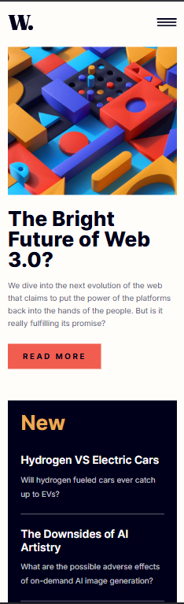

# Frontend Mentor - News homepage solution

This is a solution to the [News homepage challenge on Frontend Mentor](https://www.frontendmentor.io/challenges/news-homepage-H6SWTa1MFl). Frontend Mentor challenges help you improve your coding skills by building realistic projects. 

## Table of contents

- [Overview](#overview)
  - [The challenge](#the-challenge)
  - [Screenshot](#screenshot)
  - [Links](#links)
- [My process](#my-process)
  - [Built with](#built-with)
  - [What I learned](#what-i-learned)
  - [Continued development](#continued-development)
- [Author](#author)


## Overview

### The challenge

Users should be able to:

- View the optimal layout for the interface depending on their device's screen size
- See hover and focus states for all interactive elements on the page

### Screenshot





### Links

- Solution URL: https://github.com/ricorodriguez6596-boop/News-Homepage-by-Frontend-Ment..git

- Live Site URL: https://news-homepage-by-frontend-ment.vercel.app/

## My process

### Built with

- Semantic HTML5 markup
- CSS custom properties
- Flexbox
- CSS Grid
- JavaScript


### What I learned

I have learned to create a functioning hamburger menu.


```html
<header>
    <div class="news-logo"></div>
     <nav>
      <ul class="nav-list">
        <li><a href="#">Home</a></li>
        <li><a href="#">New</a></li>
        <li><a href="#">Popular</a></li>
        <li><a href="#">Trending</a></li>
        <li><a href="#">Categories</a></li>
      </ul>
    </nav> 
    <button class="ham-menu-button">
      
      
    </button>
  </header>
```
```css
.ham-menu-button {
        display: block;
        position: relative;
        z-index: 10;
        cursor: pointer;
    }

    .nav-list {
        gap: var(--Spacing-30);
        background-color: var(--Color-Off-White);
        flex-direction: column;
        position: fixed;  
        top: 0;
       right: 0; 
         opacity: 0;
        width: var(--Spacing-200); 
        height: 100vh;
        overflow-y: auto;
        padding-top: var(--Padding-Spacing-128);
        padding-left: var(--Spacing-26);    
    }
```
```js
let expand = () => {
    if (menuOpen) {
        navList.style.right = 0
        navList.style.opacity = 1
        menuOpen = false
        hamOpenImg.style.display = 'none'
        hamCloseImg.style.display = 'block'
    } else {
        navList.style.right = ''
        navList.style.opacity = 0
        menuOpen = true
        hamOpenImg.style.display = 'block'
        hamCloseImg.style.display = 'none'
    }

    let clos = () => {
        if (menuOpen === false) {
            navList.style.opacity = 0
            hamOpenImg.style.display = 'block'
            hamCloseImg.style.display = 'none'
            menuOpen = true
        }
    }

    section.addEventListener('click', clos)

}

hamMenu.addEventListener('click', expand)
}
```


### Continued development

- I am still not fully comfortable with hamburger menus. I am currently focusing on them.
- I am not comfortable with clamp. I always try to make it work, but I don't get the clamp. I like to use media queries instead.


## Author

- Website - [Harshit Gurjar](https://news-homepage-by-frontend-ment.vercel.app/)
- Frontend Mentor - [ricorodriguez6596-boop](https://www.frontendmentor.io/profile/ricorodriguez6596-boop)
